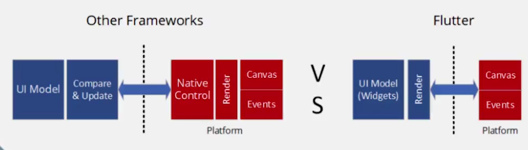
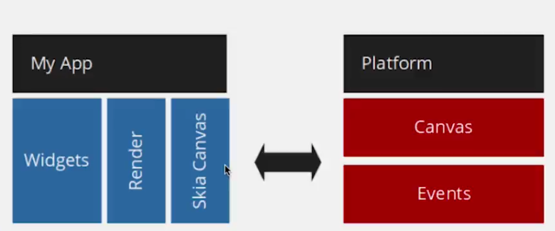
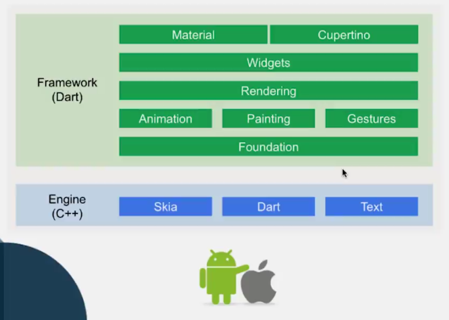
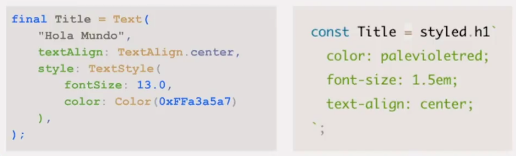
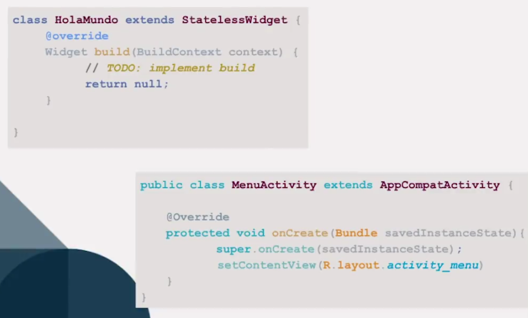

# Flutter

## Introdución

- SDK de Google creado para diseñar interfaces nativas en iOS y Android

## Historio
- 2017 nacio la version alpha
- Febrero 2018 la version beta
- Diciembre 2018 la versión Estable Flutter 1.0
- Actual Flutter 1.2

## Características Flutter
- Utiliza el lenguaje de programación Dart 2 el cual fue creado para programadores de interfaces moviles

## Desarrollo de aplicaciones moviles
### Native
- iOS
    - Objective C
    - Swift
- Android
    - Java
    - kotlin
### Hibrido
- Ionic

### Cross Platform
- Xamarin
    - C#
- React Native
    - Javascript
- NativeScript
    - Javascript
    - TypeScript
    - Angular
    - Vue
- Flutter
    - Dart 2

## Plataforma 

## Arquitectura

## Novedades
- Fuchsia SO creado por google que piensa remplezar a Android
    - Flutter sera el Framework principal para programar aplicaciones para Fuchsia

## Dart
- Flutter 
    - Mobile
- Web Codigo que corre en el navegador
    - AngularDart
    - Puedes programar con Dart el Frontend que sera el remplazo a Javascript
- Server
    - Aplicaciones de lado del servidor
    - Poder tener un Backend con Dart

## Conocimientos
- POO Java, C++, etc
- Desarrollador móvil
    - Android y iOS nativo
    - React Native
    - Xamarin
    - NativeScript

## Comparaciones
- Flutter vs Reactive Native: Flutter esta inspirado en gran parte enla programación Reactiva

- Dart vs Java: Sintaxis muy similar

### Android vs Flutter

|Android|Flutter| 
|:--:| :--: |
| View|Widget|
|XML|Widget tree|

### iOS vs Flutter
|iOS|Flutter| 
|:--:| :--: |
|UIView|Widget|
|Storyboard|Widget tree|

### Xamarin vs Flutter

|Xamarin|Flutter| 
|:--:| :--: |
|Element|Widget|
|XAML|Widget tree|

## Recursos Flutter
- [https://startflutter.com/](https://startflutter.com/)

## Recursos Dart
- [https://dartpad.dartlang.org/](https://dartpad.dartlang.org/)
- [https://app.quicktype.io/](https://app.quicktype.io/) **Generar Clase modelo**
- [Api Json](http://jsonplaceholder.typicode.com/photos)

## Recursos de Diseño
- [https://www.uplabs.com/](https://www.uplabs.com/)